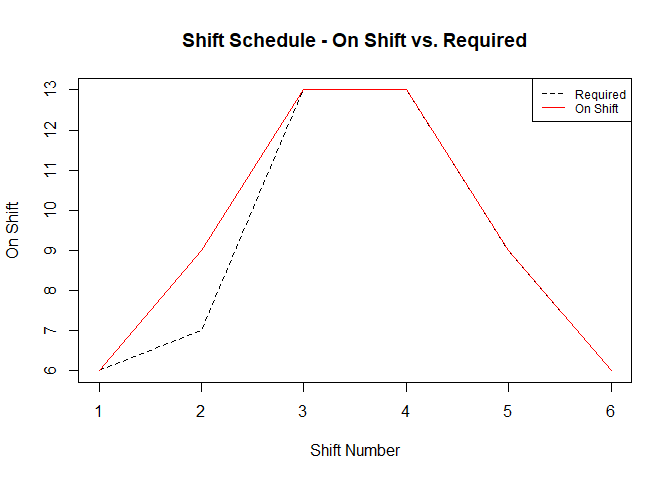

<!-- README.md is generated from README.Rmd. Please edit that file -->

## Xpress Optimization with OMPR

<!-- badges: start -->
<!-- badges: end -->

The `ompr.xpress` package allows the use of the FICO Xpress optimizer to
solve mixed integer and linear programming problems with the OMPR
package.

## Installation

A FICO Xpress installation and `xpress` package installation are
required for `ompr.xpress` to function. The `xpress` package is not
available on CRAN, but is rather included with downloads of the Xpress
solver from FICO for Xpress verions greater than 8.13.

If a commercial licensed installation is not already available to you, a
community version can be download from the link below. Community license
is limited to problem with rows + columns \<= 5000.

[FICO® Xpress Community License \|
FICO](https://www.fico.com/en/fico-xpress-community-license)

Installation instructions for the `xpress` package are located inside
the directory of the Xpress installation. Instructions from FICO are at
the link below:

[Installation of the R and Python packages
(fico.com)](https://www.fico.com/fico-xpress-optimization/docs/dms2021-04/installguide/dhtml/chapinst1_sec_secrpython.html?scroll=ssecr)

You can install the development version of ompr.xpress from
[GitHub](https://github.com/) with:

``` r
# install.packages("devtools")
devtools::install_github("bmdahl1/ompr.xpress")
```

## Example

We can use a simple police dispatch shift scheduling problem:

A police department must employ a specified number of dispatchers for
all 4-hour shifts throughout the day. Each dispatcher must work an
8-hour shift

<div id="sjbhhvktvi" style="padding-left:0px;padding-right:0px;padding-top:10px;padding-bottom:10px;overflow-x:auto;overflow-y:auto;width:auto;height:auto;">
<style>#sjbhhvktvi table {
  font-family: system-ui, 'Segoe UI', Roboto, Helvetica, Arial, sans-serif, 'Apple Color Emoji', 'Segoe UI Emoji', 'Segoe UI Symbol', 'Noto Color Emoji';
  -webkit-font-smoothing: antialiased;
  -moz-osx-font-smoothing: grayscale;
}
&#10;#sjbhhvktvi thead, #sjbhhvktvi tbody, #sjbhhvktvi tfoot, #sjbhhvktvi tr, #sjbhhvktvi td, #sjbhhvktvi th {
  border-style: none;
}
&#10;#sjbhhvktvi p {
  margin: 0;
  padding: 0;
}
&#10;#sjbhhvktvi .gt_table {
  display: table;
  border-collapse: collapse;
  line-height: normal;
  margin-left: 0;
  margin-right: auto;
  color: #333333;
  font-size: 10;
  font-weight: normal;
  font-style: normal;
  background-color: #FFFFFF;
  width: auto;
  border-top-style: solid;
  border-top-width: 2px;
  border-top-color: #A8A8A8;
  border-right-style: none;
  border-right-width: 2px;
  border-right-color: #D3D3D3;
  border-bottom-style: solid;
  border-bottom-width: 2px;
  border-bottom-color: #A8A8A8;
  border-left-style: none;
  border-left-width: 2px;
  border-left-color: #D3D3D3;
}
&#10;#sjbhhvktvi .gt_caption {
  padding-top: 4px;
  padding-bottom: 4px;
}
&#10;#sjbhhvktvi .gt_title {
  color: #333333;
  font-size: 125%;
  font-weight: initial;
  padding-top: 4px;
  padding-bottom: 4px;
  padding-left: 5px;
  padding-right: 5px;
  border-bottom-color: #FFFFFF;
  border-bottom-width: 0;
}
&#10;#sjbhhvktvi .gt_subtitle {
  color: #333333;
  font-size: 85%;
  font-weight: initial;
  padding-top: 3px;
  padding-bottom: 5px;
  padding-left: 5px;
  padding-right: 5px;
  border-top-color: #FFFFFF;
  border-top-width: 0;
}
&#10;#sjbhhvktvi .gt_heading {
  background-color: #FFFFFF;
  text-align: center;
  border-bottom-color: #FFFFFF;
  border-left-style: none;
  border-left-width: 1px;
  border-left-color: #D3D3D3;
  border-right-style: none;
  border-right-width: 1px;
  border-right-color: #D3D3D3;
}
&#10;#sjbhhvktvi .gt_bottom_border {
  border-bottom-style: solid;
  border-bottom-width: 2px;
  border-bottom-color: #D3D3D3;
}
&#10;#sjbhhvktvi .gt_col_headings {
  border-top-style: solid;
  border-top-width: 2px;
  border-top-color: #D3D3D3;
  border-bottom-style: solid;
  border-bottom-width: 2px;
  border-bottom-color: #D3D3D3;
  border-left-style: none;
  border-left-width: 1px;
  border-left-color: #D3D3D3;
  border-right-style: none;
  border-right-width: 1px;
  border-right-color: #D3D3D3;
}
&#10;#sjbhhvktvi .gt_col_heading {
  color: #333333;
  background-color: #FFFFFF;
  font-size: 100%;
  font-weight: normal;
  text-transform: inherit;
  border-left-style: none;
  border-left-width: 1px;
  border-left-color: #D3D3D3;
  border-right-style: none;
  border-right-width: 1px;
  border-right-color: #D3D3D3;
  vertical-align: bottom;
  padding-top: 5px;
  padding-bottom: 6px;
  padding-left: 5px;
  padding-right: 5px;
  overflow-x: hidden;
}
&#10;#sjbhhvktvi .gt_column_spanner_outer {
  color: #333333;
  background-color: #FFFFFF;
  font-size: 100%;
  font-weight: normal;
  text-transform: inherit;
  padding-top: 0;
  padding-bottom: 0;
  padding-left: 4px;
  padding-right: 4px;
}
&#10;#sjbhhvktvi .gt_column_spanner_outer:first-child {
  padding-left: 0;
}
&#10;#sjbhhvktvi .gt_column_spanner_outer:last-child {
  padding-right: 0;
}
&#10;#sjbhhvktvi .gt_column_spanner {
  border-bottom-style: solid;
  border-bottom-width: 2px;
  border-bottom-color: #D3D3D3;
  vertical-align: bottom;
  padding-top: 5px;
  padding-bottom: 5px;
  overflow-x: hidden;
  display: inline-block;
  width: 100%;
}
&#10;#sjbhhvktvi .gt_spanner_row {
  border-bottom-style: hidden;
}
&#10;#sjbhhvktvi .gt_group_heading {
  padding-top: 8px;
  padding-bottom: 8px;
  padding-left: 5px;
  padding-right: 5px;
  color: #333333;
  background-color: #FFFFFF;
  font-size: 100%;
  font-weight: initial;
  text-transform: inherit;
  border-top-style: solid;
  border-top-width: 2px;
  border-top-color: #D3D3D3;
  border-bottom-style: solid;
  border-bottom-width: 2px;
  border-bottom-color: #D3D3D3;
  border-left-style: none;
  border-left-width: 1px;
  border-left-color: #D3D3D3;
  border-right-style: none;
  border-right-width: 1px;
  border-right-color: #D3D3D3;
  vertical-align: middle;
  text-align: left;
}
&#10;#sjbhhvktvi .gt_empty_group_heading {
  padding: 0.5px;
  color: #333333;
  background-color: #FFFFFF;
  font-size: 100%;
  font-weight: initial;
  border-top-style: solid;
  border-top-width: 2px;
  border-top-color: #D3D3D3;
  border-bottom-style: solid;
  border-bottom-width: 2px;
  border-bottom-color: #D3D3D3;
  vertical-align: middle;
}
&#10;#sjbhhvktvi .gt_from_md > :first-child {
  margin-top: 0;
}
&#10;#sjbhhvktvi .gt_from_md > :last-child {
  margin-bottom: 0;
}
&#10;#sjbhhvktvi .gt_row {
  padding-top: 8px;
  padding-bottom: 8px;
  padding-left: 5px;
  padding-right: 5px;
  margin: 10px;
  border-top-style: solid;
  border-top-width: 1px;
  border-top-color: #D3D3D3;
  border-left-style: none;
  border-left-width: 1px;
  border-left-color: #D3D3D3;
  border-right-style: none;
  border-right-width: 1px;
  border-right-color: #D3D3D3;
  vertical-align: middle;
  overflow-x: hidden;
}
&#10;#sjbhhvktvi .gt_stub {
  color: #333333;
  background-color: #FFFFFF;
  font-size: 100%;
  font-weight: initial;
  text-transform: inherit;
  border-right-style: solid;
  border-right-width: 2px;
  border-right-color: #D3D3D3;
  padding-left: 5px;
  padding-right: 5px;
}
&#10;#sjbhhvktvi .gt_stub_row_group {
  color: #333333;
  background-color: #FFFFFF;
  font-size: 100%;
  font-weight: initial;
  text-transform: inherit;
  border-right-style: solid;
  border-right-width: 2px;
  border-right-color: #D3D3D3;
  padding-left: 5px;
  padding-right: 5px;
  vertical-align: top;
}
&#10;#sjbhhvktvi .gt_row_group_first td {
  border-top-width: 2px;
}
&#10;#sjbhhvktvi .gt_row_group_first th {
  border-top-width: 2px;
}
&#10;#sjbhhvktvi .gt_summary_row {
  color: #333333;
  background-color: #FFFFFF;
  text-transform: inherit;
  padding-top: 8px;
  padding-bottom: 8px;
  padding-left: 5px;
  padding-right: 5px;
}
&#10;#sjbhhvktvi .gt_first_summary_row {
  border-top-style: solid;
  border-top-color: #D3D3D3;
}
&#10;#sjbhhvktvi .gt_first_summary_row.thick {
  border-top-width: 2px;
}
&#10;#sjbhhvktvi .gt_last_summary_row {
  padding-top: 8px;
  padding-bottom: 8px;
  padding-left: 5px;
  padding-right: 5px;
  border-bottom-style: solid;
  border-bottom-width: 2px;
  border-bottom-color: #D3D3D3;
}
&#10;#sjbhhvktvi .gt_grand_summary_row {
  color: #333333;
  background-color: #FFFFFF;
  text-transform: inherit;
  padding-top: 8px;
  padding-bottom: 8px;
  padding-left: 5px;
  padding-right: 5px;
}
&#10;#sjbhhvktvi .gt_first_grand_summary_row {
  padding-top: 8px;
  padding-bottom: 8px;
  padding-left: 5px;
  padding-right: 5px;
  border-top-style: double;
  border-top-width: 6px;
  border-top-color: #D3D3D3;
}
&#10;#sjbhhvktvi .gt_last_grand_summary_row_top {
  padding-top: 8px;
  padding-bottom: 8px;
  padding-left: 5px;
  padding-right: 5px;
  border-bottom-style: double;
  border-bottom-width: 6px;
  border-bottom-color: #D3D3D3;
}
&#10;#sjbhhvktvi .gt_striped {
  background-color: rgba(128, 128, 128, 0.05);
}
&#10;#sjbhhvktvi .gt_table_body {
  border-top-style: solid;
  border-top-width: 2px;
  border-top-color: #D3D3D3;
  border-bottom-style: solid;
  border-bottom-width: 2px;
  border-bottom-color: #D3D3D3;
}
&#10;#sjbhhvktvi .gt_footnotes {
  color: #333333;
  background-color: #FFFFFF;
  border-bottom-style: none;
  border-bottom-width: 2px;
  border-bottom-color: #D3D3D3;
  border-left-style: none;
  border-left-width: 2px;
  border-left-color: #D3D3D3;
  border-right-style: none;
  border-right-width: 2px;
  border-right-color: #D3D3D3;
}
&#10;#sjbhhvktvi .gt_footnote {
  margin: 0px;
  font-size: 90%;
  padding-top: 4px;
  padding-bottom: 4px;
  padding-left: 5px;
  padding-right: 5px;
}
&#10;#sjbhhvktvi .gt_sourcenotes {
  color: #333333;
  background-color: #FFFFFF;
  border-bottom-style: none;
  border-bottom-width: 2px;
  border-bottom-color: #D3D3D3;
  border-left-style: none;
  border-left-width: 2px;
  border-left-color: #D3D3D3;
  border-right-style: none;
  border-right-width: 2px;
  border-right-color: #D3D3D3;
}
&#10;#sjbhhvktvi .gt_sourcenote {
  font-size: 90%;
  padding-top: 4px;
  padding-bottom: 4px;
  padding-left: 5px;
  padding-right: 5px;
}
&#10;#sjbhhvktvi .gt_left {
  text-align: left;
}
&#10;#sjbhhvktvi .gt_center {
  text-align: center;
}
&#10;#sjbhhvktvi .gt_right {
  text-align: right;
  font-variant-numeric: tabular-nums;
}
&#10;#sjbhhvktvi .gt_font_normal {
  font-weight: normal;
}
&#10;#sjbhhvktvi .gt_font_bold {
  font-weight: bold;
}
&#10;#sjbhhvktvi .gt_font_italic {
  font-style: italic;
}
&#10;#sjbhhvktvi .gt_super {
  font-size: 65%;
}
&#10;#sjbhhvktvi .gt_footnote_marks {
  font-size: 75%;
  vertical-align: 0.4em;
  position: initial;
}
&#10;#sjbhhvktvi .gt_asterisk {
  font-size: 100%;
  vertical-align: 0;
}
&#10;#sjbhhvktvi .gt_indent_1 {
  text-indent: 5px;
}
&#10;#sjbhhvktvi .gt_indent_2 {
  text-indent: 10px;
}
&#10;#sjbhhvktvi .gt_indent_3 {
  text-indent: 15px;
}
&#10;#sjbhhvktvi .gt_indent_4 {
  text-indent: 20px;
}
&#10;#sjbhhvktvi .gt_indent_5 {
  text-indent: 25px;
}
</style>
<table class="gt_table" data-quarto-disable-processing="false" data-quarto-bootstrap="false">
  <thead>
    &#10;    <tr class="gt_col_headings">
      <th class="gt_col_heading gt_columns_bottom_border gt_right" rowspan="1" colspan="1" scope="col" id="Shift.Time">Shift.Time</th>
      <th class="gt_col_heading gt_columns_bottom_border gt_right" rowspan="1" colspan="1" scope="col" id="Required">Required</th>
    </tr>
  </thead>
  <tbody class="gt_table_body">
    <tr><td headers="Shift.Time" class="gt_row gt_right">0000 - 0400</td>
<td headers="Required" class="gt_row gt_right">6</td></tr>
    <tr><td headers="Shift.Time" class="gt_row gt_right">0400 - 0800</td>
<td headers="Required" class="gt_row gt_right">7</td></tr>
    <tr><td headers="Shift.Time" class="gt_row gt_right">0800 - 1200</td>
<td headers="Required" class="gt_row gt_right">13</td></tr>
    <tr><td headers="Shift.Time" class="gt_row gt_right">1200 - 1600</td>
<td headers="Required" class="gt_row gt_right">13</td></tr>
    <tr><td headers="Shift.Time" class="gt_row gt_right">1600 - 2000</td>
<td headers="Required" class="gt_row gt_right">9</td></tr>
    <tr><td headers="Shift.Time" class="gt_row gt_right">2000 - 0000</td>
<td headers="Required" class="gt_row gt_right">6</td></tr>
  </tbody>
  &#10;  
</table>
</div>

``` r
suppressWarnings(suppressMessages(library(ompr.xpress)))
suppressWarnings(suppressMessages(library(ompr)))
suppressWarnings(suppressMessages(library(xpress)))

# Set Shift Parameters
shift_required <-  c(6,7,13,13,9,6)
n_shifts <- 6

# Create OMPR Model
model <- MIPModel() |> 
  add_variable(start_shift[s], type = 'integer', s = 1:n_shifts, lb = 0) |> 
  add_variable(on_shift[s], type = 'continuous', s = 1:n_shifts, lb = 0) |> 
  add_constraint(on_shift[s] == (start_shift[s] + start_shift[s-1]), s = 2:n_shifts) |>
  add_constraint(on_shift[s] == start_shift[s] + start_shift[n_shifts], s = 1) |> 
  add_constraint(on_shift[s] >= shift_required[s], s = 1:n_shifts) |> 
  set_objective(sum_over(start_shift[s], s = 1:n_shifts), sense = 'min')

# Solve with Xpress
model_results <- model |> 
  solve_model(xpress_optimizer())
#> 
#> Final MIP objective                   :                   28
#> Final MIP bound                       :                   28
#> Solution time / primaldual integral   :        0s /     0.01%
#> Number of solutions found / nodes     :         3 /        0
#> MIPSTATUS: 6
```

What is special about using `README.Rmd` instead of just `README.md`?
You can include R chunks like so:

<div id="cqboehqynd" style="padding-left:0px;padding-right:0px;padding-top:10px;padding-bottom:10px;overflow-x:auto;overflow-y:auto;width:auto;height:auto;">
<style>#cqboehqynd table {
  font-family: system-ui, 'Segoe UI', Roboto, Helvetica, Arial, sans-serif, 'Apple Color Emoji', 'Segoe UI Emoji', 'Segoe UI Symbol', 'Noto Color Emoji';
  -webkit-font-smoothing: antialiased;
  -moz-osx-font-smoothing: grayscale;
}
&#10;#cqboehqynd thead, #cqboehqynd tbody, #cqboehqynd tfoot, #cqboehqynd tr, #cqboehqynd td, #cqboehqynd th {
  border-style: none;
}
&#10;#cqboehqynd p {
  margin: 0;
  padding: 0;
}
&#10;#cqboehqynd .gt_table {
  display: table;
  border-collapse: collapse;
  line-height: normal;
  margin-left: 0;
  margin-right: auto;
  color: #333333;
  font-size: 10px;
  font-weight: normal;
  font-style: normal;
  background-color: #FFFFFF;
  width: auto;
  border-top-style: solid;
  border-top-width: 2px;
  border-top-color: #A8A8A8;
  border-right-style: none;
  border-right-width: 2px;
  border-right-color: #D3D3D3;
  border-bottom-style: solid;
  border-bottom-width: 2px;
  border-bottom-color: #A8A8A8;
  border-left-style: none;
  border-left-width: 2px;
  border-left-color: #D3D3D3;
}
&#10;#cqboehqynd .gt_caption {
  padding-top: 4px;
  padding-bottom: 4px;
}
&#10;#cqboehqynd .gt_title {
  color: #333333;
  font-size: 125%;
  font-weight: initial;
  padding-top: 4px;
  padding-bottom: 4px;
  padding-left: 5px;
  padding-right: 5px;
  border-bottom-color: #FFFFFF;
  border-bottom-width: 0;
}
&#10;#cqboehqynd .gt_subtitle {
  color: #333333;
  font-size: 85%;
  font-weight: initial;
  padding-top: 3px;
  padding-bottom: 5px;
  padding-left: 5px;
  padding-right: 5px;
  border-top-color: #FFFFFF;
  border-top-width: 0;
}
&#10;#cqboehqynd .gt_heading {
  background-color: #FFFFFF;
  text-align: center;
  border-bottom-color: #FFFFFF;
  border-left-style: none;
  border-left-width: 1px;
  border-left-color: #D3D3D3;
  border-right-style: none;
  border-right-width: 1px;
  border-right-color: #D3D3D3;
}
&#10;#cqboehqynd .gt_bottom_border {
  border-bottom-style: solid;
  border-bottom-width: 2px;
  border-bottom-color: #D3D3D3;
}
&#10;#cqboehqynd .gt_col_headings {
  border-top-style: solid;
  border-top-width: 2px;
  border-top-color: #D3D3D3;
  border-bottom-style: solid;
  border-bottom-width: 2px;
  border-bottom-color: #D3D3D3;
  border-left-style: none;
  border-left-width: 1px;
  border-left-color: #D3D3D3;
  border-right-style: none;
  border-right-width: 1px;
  border-right-color: #D3D3D3;
}
&#10;#cqboehqynd .gt_col_heading {
  color: #333333;
  background-color: #FFFFFF;
  font-size: 100%;
  font-weight: normal;
  text-transform: inherit;
  border-left-style: none;
  border-left-width: 1px;
  border-left-color: #D3D3D3;
  border-right-style: none;
  border-right-width: 1px;
  border-right-color: #D3D3D3;
  vertical-align: bottom;
  padding-top: 5px;
  padding-bottom: 6px;
  padding-left: 5px;
  padding-right: 5px;
  overflow-x: hidden;
}
&#10;#cqboehqynd .gt_column_spanner_outer {
  color: #333333;
  background-color: #FFFFFF;
  font-size: 100%;
  font-weight: normal;
  text-transform: inherit;
  padding-top: 0;
  padding-bottom: 0;
  padding-left: 4px;
  padding-right: 4px;
}
&#10;#cqboehqynd .gt_column_spanner_outer:first-child {
  padding-left: 0;
}
&#10;#cqboehqynd .gt_column_spanner_outer:last-child {
  padding-right: 0;
}
&#10;#cqboehqynd .gt_column_spanner {
  border-bottom-style: solid;
  border-bottom-width: 2px;
  border-bottom-color: #D3D3D3;
  vertical-align: bottom;
  padding-top: 5px;
  padding-bottom: 5px;
  overflow-x: hidden;
  display: inline-block;
  width: 100%;
}
&#10;#cqboehqynd .gt_spanner_row {
  border-bottom-style: hidden;
}
&#10;#cqboehqynd .gt_group_heading {
  padding-top: 8px;
  padding-bottom: 8px;
  padding-left: 5px;
  padding-right: 5px;
  color: #333333;
  background-color: #FFFFFF;
  font-size: 100%;
  font-weight: initial;
  text-transform: inherit;
  border-top-style: solid;
  border-top-width: 2px;
  border-top-color: #D3D3D3;
  border-bottom-style: solid;
  border-bottom-width: 2px;
  border-bottom-color: #D3D3D3;
  border-left-style: none;
  border-left-width: 1px;
  border-left-color: #D3D3D3;
  border-right-style: none;
  border-right-width: 1px;
  border-right-color: #D3D3D3;
  vertical-align: middle;
  text-align: left;
}
&#10;#cqboehqynd .gt_empty_group_heading {
  padding: 0.5px;
  color: #333333;
  background-color: #FFFFFF;
  font-size: 100%;
  font-weight: initial;
  border-top-style: solid;
  border-top-width: 2px;
  border-top-color: #D3D3D3;
  border-bottom-style: solid;
  border-bottom-width: 2px;
  border-bottom-color: #D3D3D3;
  vertical-align: middle;
}
&#10;#cqboehqynd .gt_from_md > :first-child {
  margin-top: 0;
}
&#10;#cqboehqynd .gt_from_md > :last-child {
  margin-bottom: 0;
}
&#10;#cqboehqynd .gt_row {
  padding-top: 8px;
  padding-bottom: 8px;
  padding-left: 5px;
  padding-right: 5px;
  margin: 10px;
  border-top-style: solid;
  border-top-width: 1px;
  border-top-color: #D3D3D3;
  border-left-style: none;
  border-left-width: 1px;
  border-left-color: #D3D3D3;
  border-right-style: none;
  border-right-width: 1px;
  border-right-color: #D3D3D3;
  vertical-align: middle;
  overflow-x: hidden;
}
&#10;#cqboehqynd .gt_stub {
  color: #333333;
  background-color: #FFFFFF;
  font-size: 100%;
  font-weight: initial;
  text-transform: inherit;
  border-right-style: solid;
  border-right-width: 2px;
  border-right-color: #D3D3D3;
  padding-left: 5px;
  padding-right: 5px;
}
&#10;#cqboehqynd .gt_stub_row_group {
  color: #333333;
  background-color: #FFFFFF;
  font-size: 100%;
  font-weight: initial;
  text-transform: inherit;
  border-right-style: solid;
  border-right-width: 2px;
  border-right-color: #D3D3D3;
  padding-left: 5px;
  padding-right: 5px;
  vertical-align: top;
}
&#10;#cqboehqynd .gt_row_group_first td {
  border-top-width: 2px;
}
&#10;#cqboehqynd .gt_row_group_first th {
  border-top-width: 2px;
}
&#10;#cqboehqynd .gt_summary_row {
  color: #333333;
  background-color: #FFFFFF;
  text-transform: inherit;
  padding-top: 8px;
  padding-bottom: 8px;
  padding-left: 5px;
  padding-right: 5px;
}
&#10;#cqboehqynd .gt_first_summary_row {
  border-top-style: solid;
  border-top-color: #D3D3D3;
}
&#10;#cqboehqynd .gt_first_summary_row.thick {
  border-top-width: 2px;
}
&#10;#cqboehqynd .gt_last_summary_row {
  padding-top: 8px;
  padding-bottom: 8px;
  padding-left: 5px;
  padding-right: 5px;
  border-bottom-style: solid;
  border-bottom-width: 2px;
  border-bottom-color: #D3D3D3;
}
&#10;#cqboehqynd .gt_grand_summary_row {
  color: #333333;
  background-color: #FFFFFF;
  text-transform: inherit;
  padding-top: 8px;
  padding-bottom: 8px;
  padding-left: 5px;
  padding-right: 5px;
}
&#10;#cqboehqynd .gt_first_grand_summary_row {
  padding-top: 8px;
  padding-bottom: 8px;
  padding-left: 5px;
  padding-right: 5px;
  border-top-style: double;
  border-top-width: 6px;
  border-top-color: #D3D3D3;
}
&#10;#cqboehqynd .gt_last_grand_summary_row_top {
  padding-top: 8px;
  padding-bottom: 8px;
  padding-left: 5px;
  padding-right: 5px;
  border-bottom-style: double;
  border-bottom-width: 6px;
  border-bottom-color: #D3D3D3;
}
&#10;#cqboehqynd .gt_striped {
  background-color: rgba(128, 128, 128, 0.05);
}
&#10;#cqboehqynd .gt_table_body {
  border-top-style: solid;
  border-top-width: 2px;
  border-top-color: #D3D3D3;
  border-bottom-style: solid;
  border-bottom-width: 2px;
  border-bottom-color: #D3D3D3;
}
&#10;#cqboehqynd .gt_footnotes {
  color: #333333;
  background-color: #FFFFFF;
  border-bottom-style: none;
  border-bottom-width: 2px;
  border-bottom-color: #D3D3D3;
  border-left-style: none;
  border-left-width: 2px;
  border-left-color: #D3D3D3;
  border-right-style: none;
  border-right-width: 2px;
  border-right-color: #D3D3D3;
}
&#10;#cqboehqynd .gt_footnote {
  margin: 0px;
  font-size: 90%;
  padding-top: 4px;
  padding-bottom: 4px;
  padding-left: 5px;
  padding-right: 5px;
}
&#10;#cqboehqynd .gt_sourcenotes {
  color: #333333;
  background-color: #FFFFFF;
  border-bottom-style: none;
  border-bottom-width: 2px;
  border-bottom-color: #D3D3D3;
  border-left-style: none;
  border-left-width: 2px;
  border-left-color: #D3D3D3;
  border-right-style: none;
  border-right-width: 2px;
  border-right-color: #D3D3D3;
}
&#10;#cqboehqynd .gt_sourcenote {
  font-size: 90%;
  padding-top: 4px;
  padding-bottom: 4px;
  padding-left: 5px;
  padding-right: 5px;
}
&#10;#cqboehqynd .gt_left {
  text-align: left;
}
&#10;#cqboehqynd .gt_center {
  text-align: center;
}
&#10;#cqboehqynd .gt_right {
  text-align: right;
  font-variant-numeric: tabular-nums;
}
&#10;#cqboehqynd .gt_font_normal {
  font-weight: normal;
}
&#10;#cqboehqynd .gt_font_bold {
  font-weight: bold;
}
&#10;#cqboehqynd .gt_font_italic {
  font-style: italic;
}
&#10;#cqboehqynd .gt_super {
  font-size: 65%;
}
&#10;#cqboehqynd .gt_footnote_marks {
  font-size: 75%;
  vertical-align: 0.4em;
  position: initial;
}
&#10;#cqboehqynd .gt_asterisk {
  font-size: 100%;
  vertical-align: 0;
}
&#10;#cqboehqynd .gt_indent_1 {
  text-indent: 5px;
}
&#10;#cqboehqynd .gt_indent_2 {
  text-indent: 10px;
}
&#10;#cqboehqynd .gt_indent_3 {
  text-indent: 15px;
}
&#10;#cqboehqynd .gt_indent_4 {
  text-indent: 20px;
}
&#10;#cqboehqynd .gt_indent_5 {
  text-indent: 25px;
}
</style>
<table class="gt_table" data-quarto-disable-processing="false" data-quarto-bootstrap="false">
  <thead>
    &#10;    <tr class="gt_col_headings">
      <th class="gt_col_heading gt_columns_bottom_border gt_right" rowspan="1" colspan="1" scope="col" id="Shift.Time">Shift.Time</th>
      <th class="gt_col_heading gt_columns_bottom_border gt_right" rowspan="1" colspan="1" scope="col" id="START">START</th>
      <th class="gt_col_heading gt_columns_bottom_border gt_right" rowspan="1" colspan="1" scope="col" id="ON_SHIFT">ON_SHIFT</th>
      <th class="gt_col_heading gt_columns_bottom_border gt_right" rowspan="1" colspan="1" scope="col" id="Required">Required</th>
    </tr>
  </thead>
  <tbody class="gt_table_body">
    <tr><td headers="Shift.Time" class="gt_row gt_right">0000 - 0400</td>
<td headers="START" class="gt_row gt_right">0</td>
<td headers="ON_SHIFT" class="gt_row gt_right">6</td>
<td headers="Required" class="gt_row gt_right">6</td></tr>
    <tr><td headers="Shift.Time" class="gt_row gt_right">0400 - 0800</td>
<td headers="START" class="gt_row gt_right">9</td>
<td headers="ON_SHIFT" class="gt_row gt_right">9</td>
<td headers="Required" class="gt_row gt_right">7</td></tr>
    <tr><td headers="Shift.Time" class="gt_row gt_right">0800 - 1200</td>
<td headers="START" class="gt_row gt_right">4</td>
<td headers="ON_SHIFT" class="gt_row gt_right">13</td>
<td headers="Required" class="gt_row gt_right">13</td></tr>
    <tr><td headers="Shift.Time" class="gt_row gt_right">1200 - 1600</td>
<td headers="START" class="gt_row gt_right">9</td>
<td headers="ON_SHIFT" class="gt_row gt_right">13</td>
<td headers="Required" class="gt_row gt_right">13</td></tr>
    <tr><td headers="Shift.Time" class="gt_row gt_right">1600 - 2000</td>
<td headers="START" class="gt_row gt_right">0</td>
<td headers="ON_SHIFT" class="gt_row gt_right">9</td>
<td headers="Required" class="gt_row gt_right">9</td></tr>
    <tr><td headers="Shift.Time" class="gt_row gt_right">2000 - 0000</td>
<td headers="START" class="gt_row gt_right">6</td>
<td headers="ON_SHIFT" class="gt_row gt_right">6</td>
<td headers="Required" class="gt_row gt_right">6</td></tr>
  </tbody>
  &#10;  
</table>
</div>

You’ll still need to render `README.Rmd` regularly, to keep `README.md`
up-to-date. `devtools::build_readme()` is handy for this.

You can also embed plots, for example:



In that case, don’t forget to commit and push the resulting figure
files, so they display on GitHub and CRAN.
